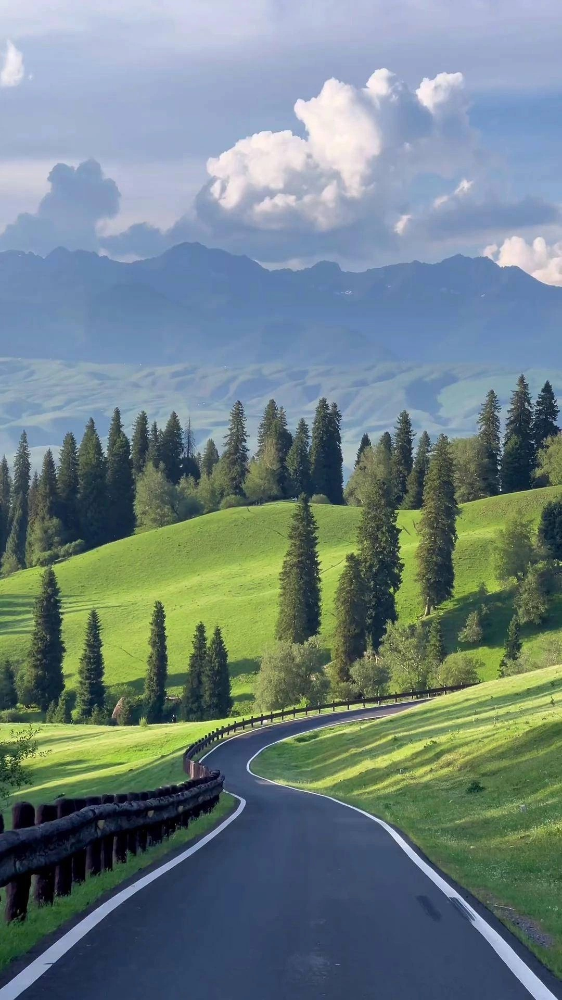
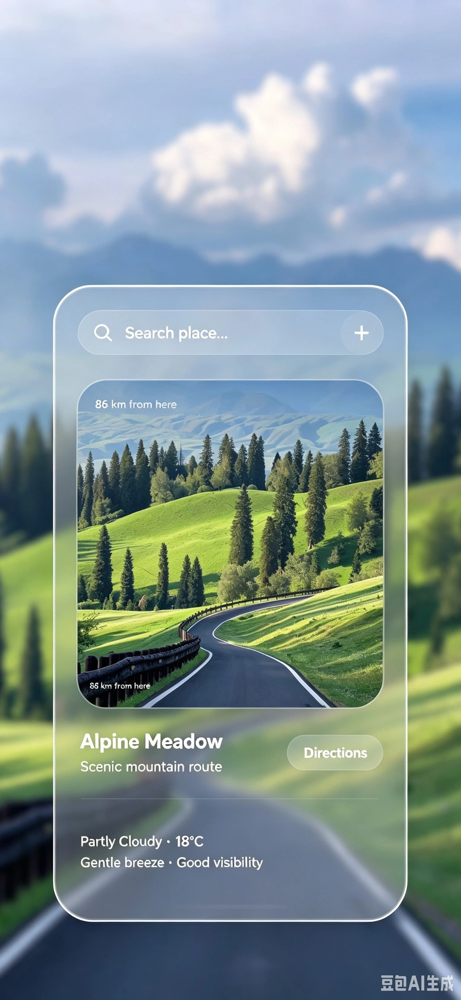

# Glassmorphism Travel Wallpaper

An AI Agent Skill that transforms any uploaded photo into a premium glassmorphism travel info card phone lock screen wallpaper.


[简体中文](./README.zh-CN.md) | English

## Features

- **9:19.5 ultra-vertical format** (1080×2340) — optimized for modern phone lock screens
- **Frosted glass UI card** — realistic frosted glass texture with subtle highlights, refraction, and light reflections, inspired by Apple Vision Pro / iOS Glass UI
- **Dynamic content** — location name, distance, and weather info are auto-generated in English based on the image content
- **Image pre-cropping** — automatically center-crops input images to 9:19.5 to prevent stretching
- **Top whitespace** — card sits in the lower portion, leaving clean space for the lock screen clock
- **Text uniqueness** — every text element appears exactly once, no duplicates

## Card Structure

1. **Search bar** — "Search place..." with magnifier icon and circular "+" button
2. **Photo preview** — rounded-corner image cropped from the uploaded photo
3. **Distance label** — e.g., "365m" overlaid on the preview's bottom-left
4. **Location info** — place title + subtitle below the preview
5. **Directions button** — semi-transparent button on the preview's bottom-right
6. **Weather info** — two lines of fine text at the card's bottom

## Installation

Simply share this repository URL with your AI agent and ask it to install and use this skill. The agent will clone or download the repository, read `SKILL.md` for the workflow, and apply it to your image generation tasks.

Example: *"Install this skill and use it: https://github.com/Irisnotiris/glassmorphism-travel-wallpaper"*

## Usage

1. Upload any travel photo to your AI agent
2. Ask: *"Make this into a glassmorphism travel wallpaper"*
3. The skill will:
   - Read and analyze your image
   - Center-crop it to 9:19.5
   - Auto-generate matching English location/weather text
   - Generate the wallpaper using an image editing tool
   - Run a quality self-check (glass texture, text uniqueness, composition)

## Example

| Input | Output |
|---|---|
|  |  |

Input: Amalfi Coast cliff village photo → Output: 9:19.5 lock screen wallpaper with frosted glass card, "Ravello Village / Amalfi Coast" location info, and weather details.

## File Structure

```
glassmorphism-travel-wallpaper/
├── SKILL.md                          # Main skill file (workflow, quality checklist)
├── README.md                         # English documentation
├── README.zh-CN.md                   # Chinese documentation
├── examples/
│   ├── input.jpg                     # Example input photo
│   └── output.jpg                    # Example output wallpaper
├── references/
│   └── prompt-template.md            # Core generation prompt with placeholders
└── scripts/
    └── crop_to_ratio.py              # Image center-cropping utility
```

## Prompt Template Placeholders

| Placeholder | Description | Example |
|---|---|---|
| `{{IMAGE_DESCRIPTION}}` | One-sentence description of the uploaded image | "Amalfi Coast cliff village, colorful houses, Mediterranean sea" |
| `{{DISTANCE}}` | Distance label (auto-inferred) | "365m" |
| `{{PLACE_TITLE}}` | Location title (auto-inferred) | "Ravello Village" |
| `{{SUBTITLE}}` | Location subtitle (auto-inferred) | "Amalfi Coast" |
| `{{WEATHER_LINE1}}` | First weather line (auto-inferred) | "Sea breeze · 12 km/h" |
| `{{WEATHER_LINE2}}` | Second weather line (auto-inferred) | "Golden Hour in 42 min" |

## Related

- [glassmorphism-travel-card](https://github.com/Irisnotiris/glassmorphism-travel-card) — 3:4 poster version (coming soon)

## License

MIT
